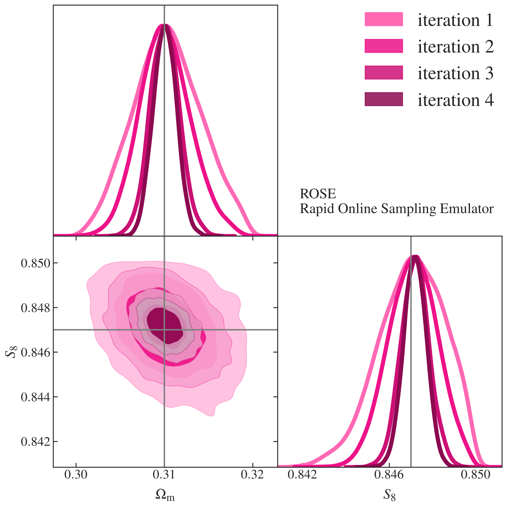

# ROSE Sampler Documentation

**ROSE** (Rapid Online Sampling Emulator) is an emulator-accelerated MCMC sampler for CosmoSIS that uses neural networks to speed up cosmological parameter estimation by 10–1000×.

<div align="center">

</div>

## Quick Start

1. **Edit your pipeline ini file:**
   ```ini
   [runtime]
   sampler = rose
   ```

2. **Add ROSE options** (optional; defaults often suffice):
   ```ini
   [rose]
   # e.g. keys, last_emulated_module, n_training, etc.
   ```

3. **Run your analysis:**
   ```bash
   cosmosis your_pipeline.ini
   ```

## What's in this directory

- `README.md` - This file
- `rose_sampler.py` - Main sampler implementation
- `config.py` - Configuration handling
- `pipeline_setup.py` - Pipeline setup and configuration
- `emulator_management.py` - Emulator training and loading
- `nn_emulator.py` - Neural network emulator
- `data_processing.py` - Data processing and sample generation
- `sampling.py` - MCMC sampling methods
- `emulator_module.py` - Emulator module interface
- `utils.py` - Utility functions
- `draft/` - Drafts and figures (e.g. `s8_omegam_lsst_3x2pt_rose.png`)

## Need help?

1. **Check the module docstrings** in `rose_sampler.py` and the mixin modules for options and behaviour.
2. **Look at example pipelines** in the cosmosis-standard-library that use `sampler = rose`.
3. **Inspect diagnostic outputs** in your run directory.
4. **Post issues** with your configuration and error messages.

## Key features

- ⚡ **10-1000x speedup** for slow cosmological pipelines
- 🧠 **Neural network emulation** with iterative training
- 🔄 **Adaptive sampling** that improves the emulator over time
- 💾 **Reusable emulators** for parameter studies
- 📊 **Built-in diagnostics** to monitor emulator quality
- 🔧 **Full CosmoSIS integration** with all standard features
